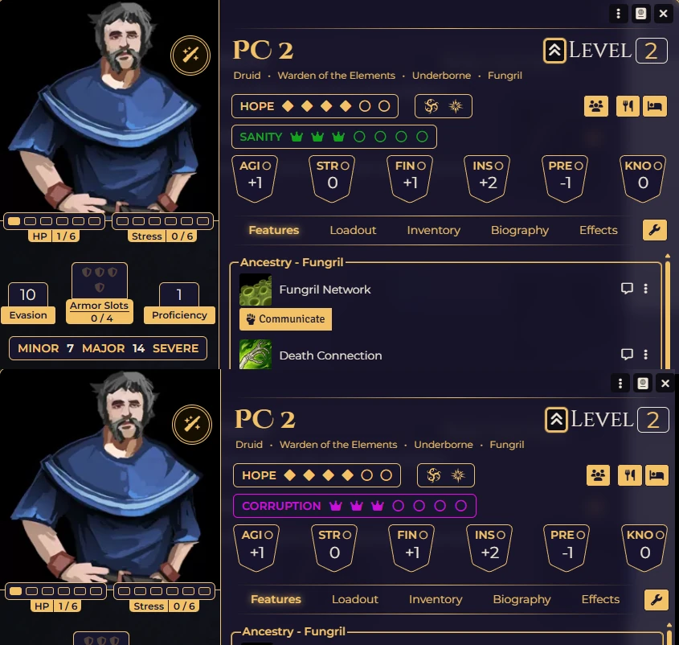
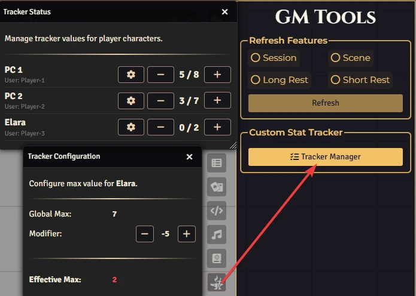
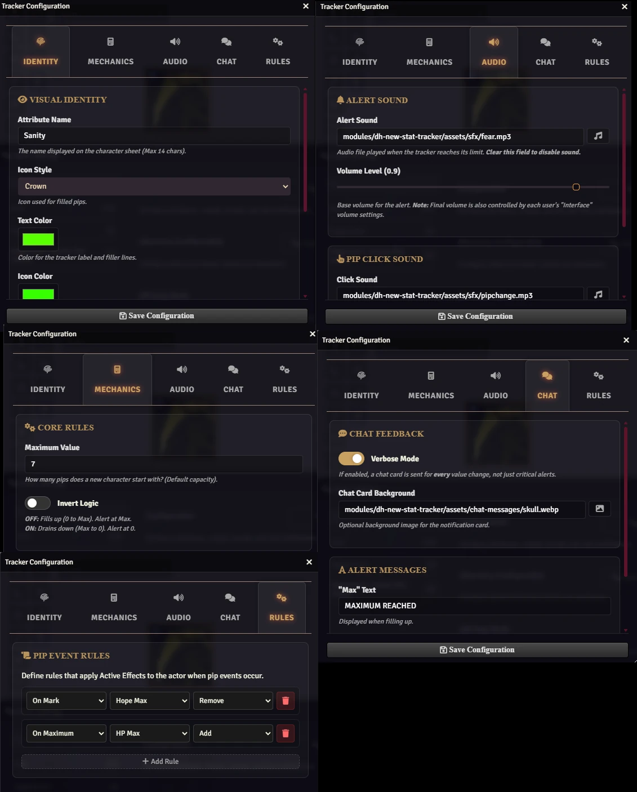

# Daggerheart: Custom Stat Tracker

A configurable custom attribute tracker for character sheets.

<p align="center">
  
</p>

# Features

*   **Custom Stat Tracker:** Add a fully configurable resource (like Despair, Sanity, or Corruption) to character sheets.
*   **Visual Customization:** Choose from over 60 icons, custom colors, and backgrounds.
*   **Immersive Feedback:** Plays sounds and sends chat alerts when values change or reach limits.
*   **GM Dashboard:** A central menu for GMs to monitor and manage all players' stats.

# How To 

You can open the Manager with the Menu Button.

<p align="center">
  
</p>

You can use a macro.

```js
DHStatTracker.openManager();
```

# Configuration

Navigate to **Settings** → **Configure Settings** → **Module Settings** → **Daggerheart: Custom Stat Tracker**

<p align="center">
  
</p>

# Manual Installation

1. Copy this link: `https://raw.githubusercontent.com/brunocalado/dh-new-stat-tracker/main/module.json`
2. Open Foundry VTT.
3. Go to the **"Add-on Modules"** tab and click **"Install Module"**.
4. Paste the link into the **"Manifest URL"** box and click Install.

# License

* **Code License:** GNU GPLv3.

* **SFX:** This module uses the sound effects from Pixabay. The audio is provided under the Pixabay Content License, which grants a non-exclusive, worldwide, and royalty-free right to use, modify, and distribute the content for digital and commercial purposes. No attribution is legally required under these terms, but it is provided here for transparency and compliance. [fear](https://pixabay.com/pt/sound-effects/horror-quot-panic-fear-quot-sound-effect-479998/] and [pipchange](https://pixabay.com/pt/sound-effects/tecnologia-new-notification-032-480570/])

**Disclaimer:** This module is an independent creation and is not affiliated with Darrington Press.

**Disclaimer:** This is a fork from this [Link](https://github.com/Tristyn159/daggerheart-foundry-tools/tree/Main/modules/new-stat-tracker).
